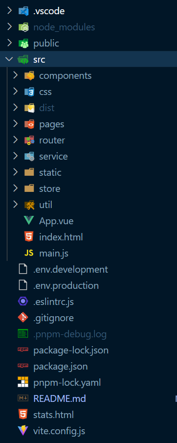

# vue3-admin
vue3+vite+pinia+elementplus搭建的管理后台

## 项目运行

```
pnpm install
```

```
pnpm run dev
```

## 项目结构



## 项目搭建

```
pnpm create vite
```

- 在执行完上面这个命令后，pnpm 首先会自动下载 `create-vite` 这个第三方包
- 然后会看到一些项目初始化的操作
  - 输入项目名称
  - 选择项目框架(我选择的是vue)
- cd到项目目录
- pnpm install
- 启动项目pnpm run dev
- 按照上图的项目目录创建好对应的文件夹

### css

这个项目使用的是less，先安装

```
npm install -g less
```

在css文件夹中创建公共的common.less

```less
@theme-color:pink;
```

想在页面中使用common.less

需要每个页面中都引入，所以有下面的配置全局样式

配置全局样式

在vite.config.js中配置

```js
import { normalizePath } from 'vite';
import { defineConfig, normalizePath } from "vite";
import vue from "@vitejs/plugin-vue";
import path from "path";
// 用 normalizePath 解决 window 下的路径问题
const variablePath = normalizePath(path.resolve("./src/css/common.less"));
export default defineConfig({
    root: path.join(__dirname, "src"),
    plugins: [vue()],
    // css 相关的配置
    css: {
        preprocessorOptions: {
            less: {
                // additionalData 的内容会在每个 less 文件的开头自动注入
                additionalData: `@import "${variablePath}";`,
            },
        },
    },
});
```

这样就可以不用每个页面都引入common.less了，可以直接使用common.less里的变量

